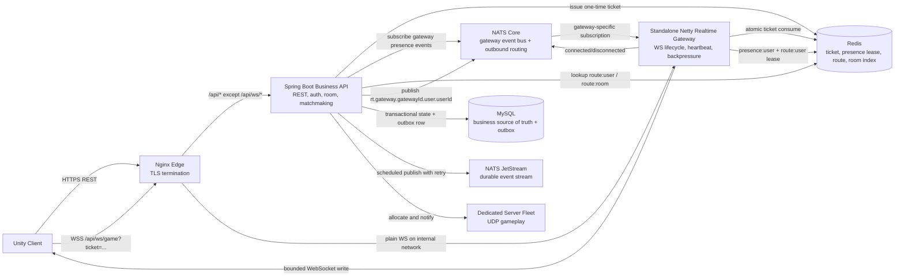
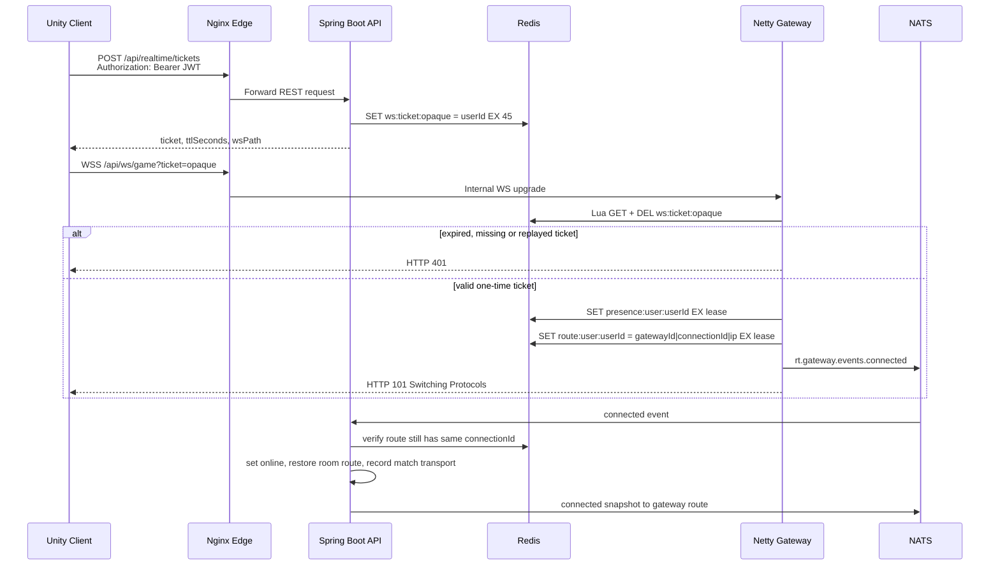
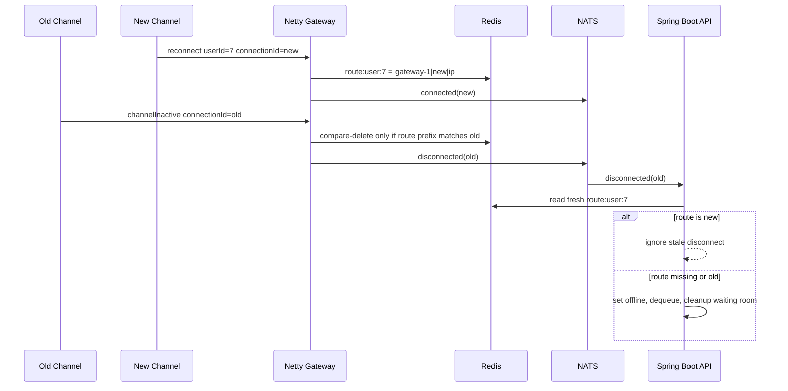
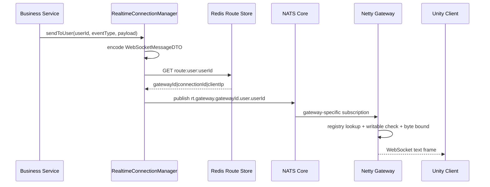
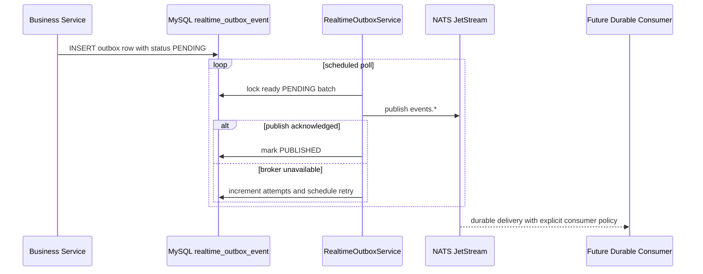
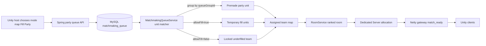

# Night Hunt Realtime Runtime Guide 2026

> Runtime snapshot: 2026-06-02
> Scope: current Netty-only realtime backend, cutover checks, runtime layers and capacity model.

## 1. Current Architecture

The realtime WebSocket path is now owned by the standalone Netty `realtime-gateway`. Spring Boot remains the business API only. It does not serve `/ws/game`, does not include `spring-boot-starter-websocket`, and does not include `spring-boot-starter-webflux`.



Public routing:

```text
https://host/api/...       -> Nginx -> Spring Boot business-api
wss://host/api/ws/game     -> Nginx -> standalone realtime-gateway
UDP gameplay               -> Dedicated Server or relay
```

## 2. Connect Sequence



Reconnect must request a new ticket every attempt. A consumed ticket cannot be reused.

## 3. Disconnect/Race Safety



Critical concurrency rules:

- Redis route release in the gateway is compare-delete by `connectionId`.
- Spring presence handlers validate `connectionId` with a fresh Redis read before applying side effects.
- Room membership updates use a Lua script to remove the old room set entry and add/delete the new mapping atomically.
- Matchmaking ticks use a Redis `SET NX` token lock, Lua renew and compare-delete release so multiple API nodes cannot form duplicate rooms.
- If Redis is unavailable, matchmaking ticks fail closed and resume after Redis recovery.
- Party queue/cancel loads the party row with a MySQL pessimistic write lock so duplicate host requests cannot both enqueue from `IDLE`.
- Netty event loops never run MySQL/JPA/business mutation work.

## 4. Outbound Event Sequence

Examples: `room_updated`, `match_ready`, `ds_ready`, `force_logout`.



## 5. Durable Outbox Sequence

Implemented initial durable subjects: `events.ds.ready` and `events.match.ended`.



The producer and stream creation exist. Domain durable consumers, idempotency records and DLQ handling remain future migration work.

## 6. Layer Responsibilities

| Layer | Owns | Must not own |
|---|---|---|
| Unity client | REST login, ticket request, WSS reconnect with backoff, snapshots after reconnect | Broker topology, database state |
| Nginx edge | TLS, routing, query-safe logs, file descriptor limits | Business logic, MySQL, Redis |
| Netty gateway | Handshake, ticket consume, channel registry, heartbeat, lease refresh, slow-consumer disconnect, NATS subscribe/publish | JPA, MySQL, inventory, party mutation, matchmaking algorithm |
| Spring Boot business API | Auth, room, party, matchmaking, DS control, MySQL transactions, outbox producer, realtime event encode/publish | Long-lived socket ownership |
| Redis | Ticket, presence lease, `userId -> gatewayId` route, room route index, cache | Durable business source of truth |
| NATS Core | Low-latency ephemeral routing and gateway lifecycle events | Durable storage |
| JetStream | Durable workflow event persistence and replay | Business source of truth |
| MySQL | Persistent business state and outbox rows | WebSocket hot path |
| Dedicated Server | Authoritative match gameplay over UDP | Lobby WebSocket fan-out |

## 6.1 Ranked Party Fill Model

Premade party membership is persistent in MySQL. Fill teammates exist only in the matchmaking queue and ranked room for one match.



Rules:

- `queueGroupId=party:<partyId>` keeps all original party members on one team.
- `queueGroupId=solo:<userId>` keeps solo fill players independent.
- `allowFill=true` permits other queue units to occupy the remaining slots on that team.
- `allowFill=false` makes an underfilled premade team valid without inserting strangers.
- Fill players are never inserted into `party_members`.
- After `POST /api/match/end`, original ranked party state returns to `IDLE/NONE`.

## 7. Implementation Status

| Capability | Status | Notes |
|---|---|---|
| Nginx `/api/ws/` route to standalone gateway | Implemented | VPS compose validation is still required. |
| One-time ticket and replay rejection | Implemented and unit-tested | Unity uses ticket flow. |
| Netty socket registry | Implemented and unit-tested | Single-device replacement and bounded pending outbound bytes exist. |
| Async Redis gateway hot path | Implemented | Gateway uses Lettuce async commands and does not query MySQL. |
| Gateway connected/disconnected events | Implemented and unit-tested | Spring validates fresh `connectionId` before side effects. |
| NATS Core outbound delivery | Implemented | Route is selected from Redis `route:user:*`. |
| Spring WebSocket/WebFlux fallback | Removed | Business API no longer serves WebSocket. |
| Redis atomic room route update | Implemented | Lua script keeps `route:user-room` and `route:room:*:users` in sync. |
| Outbox producer and retry | Partially implemented | Initial subjects: `events.ds.ready`, `events.match.ended`. |
| Durable JetStream consumers and idempotency | Not implemented | Required before claiming durable workflow completion. |
| Gateway graceful drain | Not implemented | Required for clean rolling restart and reconnect storm control. |
| Gateway connect and message rate limit | Not implemented | Required before public abuse hardening is complete. |
| Origin and protocol-version validation | Not implemented | Required before final public cutover. |
| DS orchestrator extraction | Not implemented | Backend still owns Docker lifecycle during transition. |
| Multi-gateway verification | Prepared, not certified | `gatewayId` routing exists; two-node test remains. |
| Region selection | Future phase | Must follow single-node and two-gateway certification. |
| Ranked premade party fill/no-fill | Implemented and unit-tested | Staging acceptance scenarios remain required before cutover. |

## 8. Capacity Model

No CCU number is certified until the staging/VPS load test records actual CPU, memory, Redis, NATS, Nginx and gateway metrics.

Useful planning envelope:

| Environment | Initial objective | Interpretation |
|---|---:|---|
| Shared `2 vCPU / 8 GiB` VPS running edge, API, Redis, NATS, MySQL and gateway | `5,000` stable CCU first gate | Reasonable first certification checkpoint. |
| Same shared VPS | `10,000` stable CCU stretch gate | Measure, not promise. |
| Dedicated gateway node with small frames and mostly idle connections | `20,000-50,000` CCU experiment | Requires external load generation and resource tuning. |
| Any `50,000+` target | Horizontal scale | Use multiple gateway nodes and measure Redis, NATS and edge separately. |

Heartbeat-driven Redis write estimate:

```text
Redis lease SET/s ~= CCU * 2 / heartbeat interval seconds

10,000 CCU -> about 2,000 Redis SET/s at 10s heartbeat
20,000 CCU -> about 4,000 Redis SET/s at 10s heartbeat
50,000 CCU -> about 10,000 Redis SET/s at 10s heartbeat
```

Outbound fan-out matters more than connection count:

```text
recipient deliveries/s = logical events/s * average recipients per event
```

## 9. Required Cutover Order

1. Deploy staging with the required NATS and JetStream services running; the migrated backend no longer supports disabling them.
2. Confirm `/api/ws/game` is served by `nighthunt-realtime-gateway`, not backend.
3. Confirm ticket issue, first WSS `101`, replay rejection and Unity reconnect.
4. Validate `connected`, `disconnected`, `ds_ready`, `match_ended`, room and force-logout delivery through the gateway.
5. Run mixed k6 WS and JMeter REST load from an external generator.
6. Record CPU, memory, file descriptors, Redis latency, NATS latency and p95/p99 RTT at every staircase level.
7. Add graceful drain, gateway rate limits, protocol validation and broker credentials.
8. Move durable invite, party and match workflows to JetStream consumers with idempotency and DLQ handling.
9. Extract DS orchestration and remove Docker socket access from business-facing services.
10. Certify two gateway nodes before adding region selection.

## 10. Source Map

| Concern | File |
|---|---|
| Unity ticket reconnect | `NightHuntClient/Assets/_Night_Hunt/Scripts/Services/Game/GameWebSocketService.cs` |
| REST ticket issue | `src/main/java/com/nighthunt/realtime/controller/RealtimeTicketController.java` |
| Ticket storage | `src/main/java/com/nighthunt/realtime/service/RealtimeTicketService.java` |
| Netty bootstrap | `realtime-gateway/src/main/java/com/nighthunt/gateway/RealtimeGatewayApplication.java` |
| Ticket consume | `realtime-gateway/src/main/java/com/nighthunt/gateway/netty/TicketHandshakeHandler.java` |
| WS frame lifecycle | `realtime-gateway/src/main/java/com/nighthunt/gateway/netty/WebSocketFrameHandler.java` |
| Backpressure and channel registry | `realtime-gateway/src/main/java/com/nighthunt/gateway/connection/ConnectionRegistry.java` |
| Redis presence lease | `realtime-gateway/src/main/java/com/nighthunt/gateway/redis/RedisPresenceStore.java` |
| Gateway lifecycle event publisher | `realtime-gateway/src/main/java/com/nighthunt/gateway/event/NatsGatewayEventPublisher.java` |
| Gateway NATS outbound subscriber | `realtime-gateway/src/main/java/com/nighthunt/gateway/nats/NatsOutboundSubscriber.java` |
| Spring gateway presence subscriber | `src/main/java/com/nighthunt/realtime/adapter/NatsGatewayPresenceSubscriber.java` |
| Spring presence side effects | `src/main/java/com/nighthunt/realtime/service/GatewayPresenceEventHandler.java` |
| Spring NATS publisher | `src/main/java/com/nighthunt/realtime/adapter/NatsRealtimeEventPublisher.java` |
| Redis route store | `src/main/java/com/nighthunt/realtime/service/RealtimeRouteStore.java` |
| Durable outbox poller | `src/main/java/com/nighthunt/realtime/service/RealtimeOutboxService.java` |
| JetStream publisher | `src/main/java/com/nighthunt/realtime/adapter/NatsJetStreamEventPublisher.java` |
| Edge route | `docker/nginx/conf.d/nighthunt.conf` |
| k6 realtime certification | `load-tests/k6/ws_load_test.js` |
